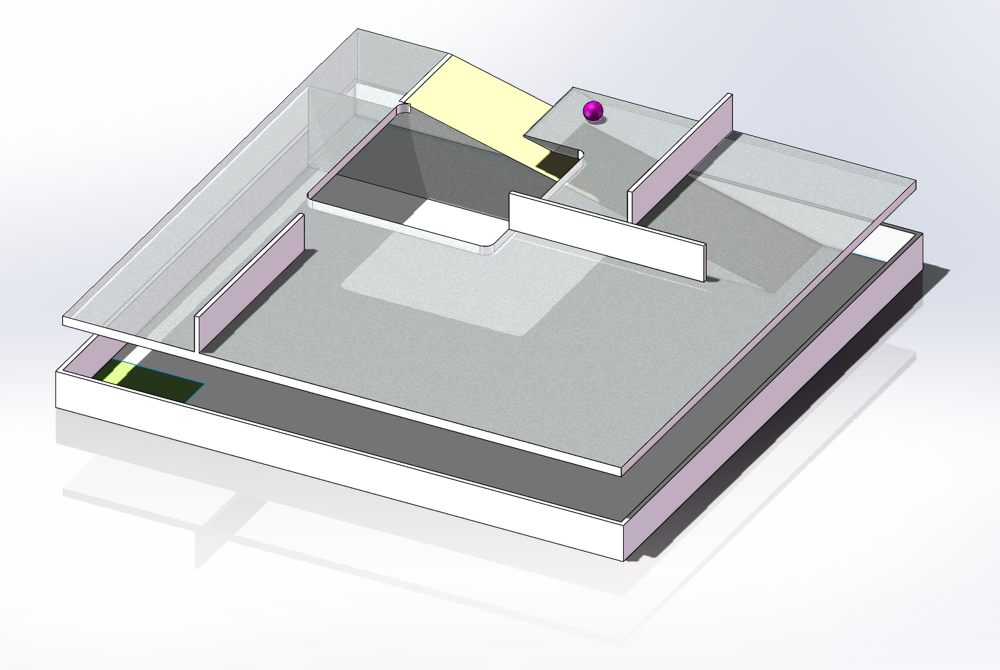
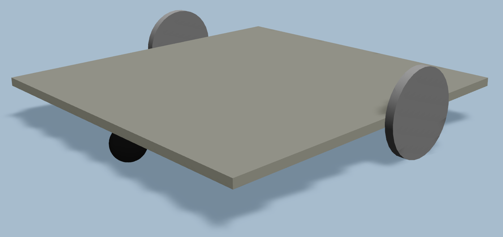

# 简易仿真和路径规划

由于在现实中我们没有成品机器人……所以只好搓一辆魔法小车来练练手……

小车怎么搓？拿起你的魔法棒……

<iframe frameborder="no" border="0" marginwidth="0" marginheight="0" width=298 style="width: 80%; margin: auto" height=52 src="https://music.163.com/outchain/player?type=2&id=483024749&auto=0&height=32"></iframe>

[Hedwig's Theme](https://music.163.com/outchain/player?type=2&id=483024749&auto=0&height=32)

## 起点

本题分关卡组织，目前不允许跳关。不要求一定完成所有的关卡，但仍请尽力而为。对于没有完成的关卡，可使用 Markdown 编写文档说明思路。

本题附带有附件，请将所有关卡的文件命名打包提交。命名合理即可，但请考虑使用英文以避免可能存在的乱码问题。所有的提交文件力求简洁。如果需要额外安装软件包，请说明。

不要害怕！保持紧张，按部就班！

### 1.  搭建一个属于自己的小车 - Step 1

#### 内容

1. 设置仿真系统，使一辆差速轮小车在 `arena.world` 所描述的世界中运行。
2. 公布 ROS 2 话题 `/cmd_vel` 使用类型 `geometry_msgs/msg/Twist` 受外围控制。

#### 提示

* 这里小车不需要很多零件……在魔法的驱动下，小车只需要 1 个底盘和 2 个轮子就可以运行了。
* 

设置 Gazebo ，网上有很多教程，不过，不要把 Gazebo (Classic) 和 Ign Gazebo 混淆了。
Ign Gazebo 是 Gazebo Classic 的升级版。启动 Gazebo Classic 可以用 `gazebo`，启动 Ign Gazebo 可以用 `ign`。它们都是 ROS 官方支持的版本，可以随 ROS 2 一起安装。 我们没有使用新版 Gazebo 是……“历史原因”

* Gazebo Classic 的官方入门： [Gazebo Tutorial](https://classic.gazebosim.org/tutorials)。如果参考该文档，请配合下面链接使用。（里面有现成的可以拿来用😝）
* ROS 2 下的“魔法”迁移指南： [Home · ros-simulation/gazebo_ros_pkgs Wiki · GitHub](https://github.com/ros-simulation/gazebo_ros_pkgs/wiki) 。驱动小车的“魔法”有很多项，适用于差速轮小车的有 `gazebo_ros_diff_drive` …… 而日后可以试试魔法 [ros_control](https://control.ros.org/humble/index.html) （只要你不得罪电控组 (误)）
* 这里是魔法世界，不是物理世界，所以一辆普通的魔法小车就够了……
  
* 场地（墙内）为 6000✖️6000 尺寸。默认情况，绿色标识角为世界原点。

#### 如果截止到这一关，你需要提交……

* 描述你的小车的模型并且足够它所给世界中运行起来的所有文件，以及必要的说明
* 你认为需要提交，但是我没提到的任何补充材料。（这话……你就当我后面一直重复好了）

### 2. 试着驾驶一下这辆车……

#### 内容

* `ros2 run teleop_twist_keyboard teleop_twist_keyboard`
* 把科目三给我考下来！（并不需要）

#### 提示

* 按照（不知从哪里来的）约定，使用右手坐标系，车体前进方向为车体坐标系 X 轴正向，Z 轴向上指。
* 接下来你要选择你的故事分支了……只需要完成其中一个。

#### 如果截止到这一关，你需要提交……

* 空气

## 情节分支 1

### 3. 设置 Navigation 2

#### 内容

1. 回顾你的小车，决定你所需要额外添加的传感器……
2. 看一下 Nav 2 的使用，理解导航系统的工作机制。
3. 设置 Nav 2，让小车在场地中运动。路径指定为从绿色区域触发移动到二层

#### 提示

* 如果采用魔法 `gazebo_ros_diff_drive` ，那么你可能获得一个由魔法驱动的定位系统，保证绝对准确…… 在这里你是可以使用它的（在麻瓜世界中，请和负责定位的人打好配合）……
* 额外加入激光雷达，就可以让 Nav 2 给你建立场地的地图…… 不过呢，这看…… 这里是静态场地…… 其实 Nav 2 的地图是可以自己画的。（诸多图像编辑软件，例如 Photoshop 和 GIMP 是支持编辑 .pgm 图像的）……虽然不规范，但是场地图纸是存在的。（高考的图准对！电阻是可以 **撕下来** 用万用表测量的！）
* Nav 2 （以及 RViz） 喜欢挑 TF 树的毛病…… 虽然但是，有个不错的可视化可以大幅提高我对你的第一印象……
* 可参考 [nav2_bringup](file:///opt/ros/humble/share/nav2_bringup) 功能包……
* Nav 2 是被设计期望在各个场景下通用的系统…… 通过工程设计让它能够适用于多种多样的情况……
* Nav 2 的 Unicode 支持不好……虽然，我也没想到这种事会在 Linux 下发生。
* 允许抄现成的配置文件……

#### 如果截止到这一关，你需要提交……

* 提交一个功能包/工作空间，包括你需要附带的所有配置，程序，脚本，等。我们将会编译（如果你使用 C/C++ 等）并且运行你的程序……
* 一个……常见格式的文件，描述你对 Nav 2 的架构的理解。

### 4. 把球推下去

#### 内容

1. 写一段全自动的程序，把二层的球推到一层斜坡。
2. 看看怎么让你的车跑得流畅些……

#### 提示

* 作为一个系统……有时牵一发而动全身……所以……小心点，善用 `rqt` `ros2 lifecycle` 等工具。
* 小心配置你的系统…… 需要考虑好怎么处理上楼的问题呢…… 需要考虑好怎么处理上楼的问题呢……av 2 的默认配置只支持 2D 地图，但是不必要太过纠结……
* 程序需一键启动，启动后不应该有额外的干预。
* 谁说静态地图不可更换？如果你对这个感兴趣，请考虑 `/map_server/load_map` 服务

#### 如果截止到这一关，你需要提交……

* 提交一个功能包/工作空间……
* 小车完成任务的录像……
* （可选）如果有心得可以写上来……

### 5. 接下来……

#### 内容

* 调查 Nav 2 使用的算法，看你感兴趣的……对其优劣进行对比。
* 对于一些有意思的，不妨在自己的小车上试试。

#### 提示

* 第二周考核题里面的 A* 题目会让你有什么想法吗？
* 一周时间……我并没有强制要求你把所有的都看完……捡你感兴趣的。
* 许多控制法是有其应用场景和对应要解决的问题的，各自有各自的优势，不是东风和西风那样互相压倒。

#### 如果截止到这一关，你需要提交……

* ……
* 你对所调查算法的认识。

## 情节分支 2

### 3. 直接执行你的任务

#### 内容

写一段全自动的程序，把二层的球推到一层斜坡。

（这个分支很短，并且看上去比 Nav 2 框架省事得多……）

#### 提示

* 你可以尝试使用你能想到的各种方法……但禁止使用全开环控制（例如，用 `teleop_twist_keyboard` 遥控机器人运动并用 `ros2 bag` 复现运动指令消息，或者，诸如 `前进 xx 秒，左转 xx 秒` 等），并且，禁止使用 Nav 2 框架。
* 受限于布线、USB 接口数量限制等因素，可以使用传感器，但不建议堆叠过多的传感器。
* 如果你选择跳过 Nav 2 的调查，你需要回答更多问题……
* 你从此就要开始和电控组抢生意了……
* <del>（还好你不是打 RoboMaster 的）</del>
* 好像没有人用 RRT 算法？

#### 如果截止到这一关，你需要提交……

* 提交一个功能包/工作空间，包括你需要附带的所有配置，程序，脚本，等。我们将会编译（如果你使用 C/C++ 等）并且运行你的程序……
* 一个常见格式的文件，描述
  * 你的方法的实现思路？
  * 你的方法的优点以及（如果有的话）局限性？
  * （可选）为什么你要使用这个方法而不是使用可能想到的其他方法？
* 另一个常见格式的文件，回答其他问题：
  * 如果要走的可能的起点和终点有很多个搭配，不会对你造成麻烦吧？如果会，你打算？
  * 如果有事先不确定的障碍物，你会？
  * 如何保证路径足够高效，不至于让你的车不得不比对面拿遥控器新手开的还慢？
  * 考虑到车不能瞬时启动/停止，你怎么处理速度问题？
  * 续上面的，车不能瞬时转弯，那么如果需要临时切换目标点，你会？
  * 如果……你的机器人它接受的是具有速度标记的路径，而不是想仿真机器人那样的运动指令，你会？
  * 请设计你的路径模块和其他模块的通信接口…… （在 ROS 2 环境下你自然可以使用 ROS 2 的消息机制）
  * 对该领域常见算法的评头论足……
  * ……凭什么你的方法比 Nav 2 优越？（误）它在 RoboCon 比赛中能被持续应用下去吗？
  
## 255. XXXX

#### 内容

略

#### 如果截止到这一关，你需要提交……

* 一瓶香槟🎉